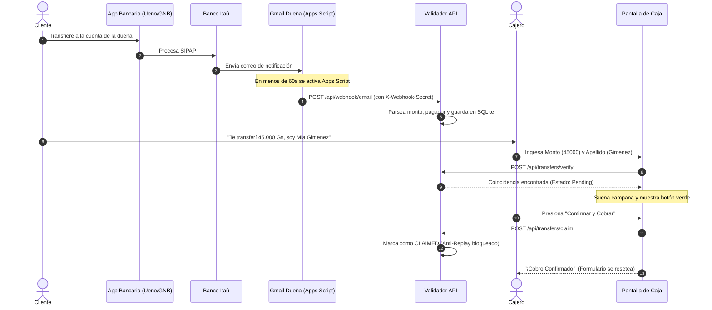

# 🏪 Validador de Transferencias para PYMEs (Itaú, GNB, UENO / SIPAP Paraguay)

[](https://www.typescriptlang.org/)
[](https://nodejs.org/)
[](#-arquitectura)
[](#-pruebas-automatizadas)
[](https://opensource.org/licenses/MIT)

Sistema open-source en **TypeScript** diseñado para resolver el cuello de botella más común en cajas de comercios (kioskos, almacenes, farmacias, cafeterías): **verificar transferencias bancarias en tiempo real sin requerir que la dueña revise su celular ni compartir contraseñas de correos o cuentas bancarias con los empleados.**

---

## ⚡ Despliegue en 1 Clic (100% Gratuito)

Desplegá tu propia instancia del validador en la nube en menos de 2 minutos sin pagar un solo dólar por servidores ni dominios:

[](https://render.com/deploy?repo=https://github.com/fugc123/validador-transferencias-pymes)
[](https://railway.app/template/new?template=https://github.com/fugc123/validador-transferencias-pymes)

---

## 🚀 Problema vs Solución

| El Problema Habitual | Nuestra Solución con Validador PYME |
|---|---|
| ❌ La dueña vive esclava del celular esperando que los cajeros le pregunten *"¿te llegó la plata?"*. | ✅ Los empleados validan el pago en **2 segundos** desde una pantalla web en la caja. |
| ❌ **Riesgo Crítico de Seguridad:** Darles la clave de Gmail a los empleados para que revisen los correos. | ✅ **Zero-Credentials:** Los empleados jamás acceden al Gmail ni ven las transferencias personales de la dueña. |
| ❌ **Estafa del Comprobante Reutilizado:** Clientes que pagan compras distintas usando la misma captura de pantalla. | ✅ **Anti-Replay Guard:** Cada transferencia se bloquea al instante de ser cobrada. Si la vuelven a presentar, la pantalla alerta en **ROJO**. |
| ❌ Clientes esperando 1 minuto con la fila trabada. | ✅ Validación en **15 milisegundos** gracias a SQLite nativo indexado. |

---

## 🏛️ Arquitectura del Sistema

Construido siguiendo **Clean Architecture (Puertos y Adaptadores)** en TypeScript estricto:

```
src/
├── domain/                      # Lógica de Negocio Pura (Independiente de frameworks)
│   ├── entities/                # Transfer y User Entities con invariantes de estado
│   └── ports/                   # Contratos (ITransferRepository, IUserRepository, IBankParser)
├── infrastructure/              # Adaptadores Tecnológicos
│   ├── database/                # SqliteTransferRepository y SqliteUserRepository (node:sqlite)
│   └── parsers/                 # BankParserFactory (Patrón Strategy multi-banco: Itaú, GNB, UENO)
│       ├── itau-paraguay.parser.ts
│       ├── gnb-paraguay.parser.ts
│       └── ueno-bank.parser.ts
├── application/                 # Casos de Uso del Negocio
│   ├── use-cases/               # IngestEmail, VerifyTransfer, ClaimTransfer, AuthUseCases, AdminUseCases
│   └── dto/                     # Contratos tipados de entrada y salida
├── presentation/                # Controladores y Middlewares HTTP
│   ├── controllers/             # TransferController, AuthController, AdminController
│   └── middlewares/             # WebhookAuth, AuthenticateJwt, RequireRole, RateLimiter, Helmet
└── public/                      # UI de Punto de Venta y Panel Admin
    ├── index.html               # Pantalla de Caja (Audio sintetizado Web Audio API)
    └── admin.html               # Dashboard Administrativo y Gestión de Cajeros
```

---

## 🔄 Flujo de Trabajo en Tiempo Real



---

## 💻 Instalación y Ejecución Local

### Requisitos
- **Node.js v22 o v24+** (utiliza `node:sqlite` nativo).
- Git.

### Pasos
```bash
# 1. Clonar el repositorio
git clone https://github.com/fugc123/validador-transferencias-pymes.git
cd validador-transferencias-pymes

# 2. Instalar dependencias
npm install

# 3. Configurar variables de entorno (crear copia desde .env.example)
cp .env.example .env
# En Windows PowerShell si no tenés cp:
# Copy-Item .env.example .env

# 4. Compilar TypeScript
npm run build

# 5. Iniciar en modo desarrollo
npm run dev

# 6. O iniciar en modo producción
npm start
```

Abrir en el navegador: **[http://localhost:3000](http://localhost:3000)**

> **Credenciales iniciales por defecto:**  
> Email: `admin@kiosko.com`  
> Contraseña: `admin123`  
> *(Podés modificarlas a tu gusto en el archivo `.env` antes de iniciar).*

---

## 🧪 Pruebas Automatizadas

El proyecto cuenta con suites completas de pruebas unitarias y de integración E2E con **Jest** y **Supertest** (25/25 tests passing):

```bash
# Ejecutar todas las pruebas (25/25 passing)
npm test

# Ejecutar solo unitarias
npm run test:unit

# Ejecutar solo E2E
npm run test:e2e
```

---

## 🌐 Pruebas Locales con Gmail (¿Por qué no funciona con `localhost`?)

> [!IMPORTANT]
> **Google Apps Script se ejecuta en los servidores en la nube de Google**, no en tu computadora.  
> Si configuras `http://localhost:3000` en Apps Script, Google intentará conectarse a su propio datacenter y fallará con `Address unavailable`.

Para probar con tu Gmail real desde tu máquina local antes de desplegar a la nube, necesitas exponer tu puerto 3000 con un túnel HTTPS público temporal (recomendamos **Cloudflare Tunnel**):

```bash
# En Windows (usando cloudflared o npx):
npx cloudflared tunnel --url http://localhost:3000
```
Copia la URL pública generada (ej: `https://tu-tunel-random.trycloudflare.com/api/webhook/email`) y úsala en tu script de Google.

---

## 📧 Configuración en Gmail de la Dueña (Automatización Serverless 24/7)

El script de integración es **100% Serverless (FaaS)**: no requiere servidores intermediarios ni consumo permanente de CPU. Se despierta automáticamente en la nube de Google cada 60 segundos, procesa transferencias entrantes y se apaga de inmediato.

### Paso a Paso:

1. **Crear el script en Google:**
   - Ingresar a [script.google.com](https://script.google.com/) con la cuenta de Gmail donde llegan los avisos bancarios.
   - Hacer clic en **"Nuevo proyecto"**.
2. **Pegar el código:**
   - Reemplazar todo el contenido del editor por el código de [`google-apps-script/code.gs`](google-apps-script/code.gs).
3. **Configurar credenciales:**
   - `WEBHOOK_URL`: La URL de tu servidor en producción (ej. de Render: `https://tu-app.onrender.com/api/webhook/email`) o la URL de tu túnel de prueba.
   - `WEBHOOK_SECRET`: La misma clave secreta configurada en tu archivo `.env`.
   - Guardar con `Ctrl + S`.
4. **Autorizar permisos (Solo la primera vez):**
   - Haz clic en **"Ejecutar"** arriba.
   - Google mostrará una advertencia: *"Google no ha verificado esta aplicación"*. Esto es normal porque es un script privado creado por ti.
   - Haz clic en **"Configuración avanzada"** (a la izquierda del botón azul).
   - Haz clic en el enlace inferior **"Ir a [Nombre de tu proyecto] (no seguro)"**.
   - Haz clic en **"Permitir"**.
5. **Activar Automatización 24/7 (¡Para no tener que tocar "Ejecutar" nunca más!):**
   - En la barra lateral izquierda, haz clic en el ícono del **Reloj** (**"Activadores"**).
   - Clic en el botón azul abajo a la derecha: **"+ Añadir activador"**.
   - Configuración:
     - **Función que se ejecutará:** `procesarCorreosItau`
     - **Fuente del evento:** `Según tiempo` *(Time-driven)*
     - **Tipo de activador:** `Temporizador por minutos` *(Minutes timer)*
     - **Intervalo de minutos:** `Cada 1 minuto`
   - Clic en **"Guardar"**.

¡Listo! A partir de ese momento, cada vez que un cliente transfiera por **Itaú**, **Banco GNB** o **UENO Bank**, Google lo detectará en menos de 60 segundos y lo enviará automáticamente a tu pantalla de caja.

---

## 🛡️ Panel Administrativo (`/admin.html`)

El sistema incluye un dashboard exclusivo para el dueño del negocio:
- **Acceso:** `http://localhost:3000/admin.html` (o tu dominio en la nube).
- **Gestión de Cajeros:** Crear, editar contraseñas y eliminar cuentas de empleados.
- **Selector de Banco Activo:** Definir cuál banco tiene prioridad en la caja (Itaú, Banco GNB, UENO Bank).
- **Registro de Auditoría:** Historial completo de transferencias recibidas y reclamos con hora y cajero responsable.

---

## 🔌 Guía de Pruebas con cURL (API Rápida)

### 1. Iniciar sesión como Cajero / Admin
```bash
curl -X POST http://localhost:3000/api/auth/login \
  -H "Content-Type: application/json" \
  -d '{"email": "admin@kiosko.com", "password": "admin123"}'
```

### 2. Simular recepción de correo de Itaú (Webhook)
```bash
curl -X POST http://localhost:3000/api/webhook/email \
  -H "Content-Type: application/json" \
  -H "X-Webhook-Secret: kiosko-secreto-2026" \
  -d '{
    "text": "A continuación el detalle de la operación:\nNro. de operación: COMAPYPAARES260914370460000640061\nFecha y hora de operación: 14/09/2026 10:17:26\nCliente Pagador: MIA FIORELLA GIMENEZ AQUINO\nMoneda y Monto: PYG 45,000\nNro. comprobante: 8351454\nEstado: Transferencia acreditada en cuenta"
  }'
```

### 3. Verificar transferencia desde la caja
```bash
curl -X POST http://localhost:3000/api/transfers/verify \
  -H "Content-Type: application/json" \
  -H "Authorization: Bearer <TU_TOKEN_JWT>" \
  -d '{"amount": 45000, "name": "Gimenez"}'
```

---

## 📄 Licencia

Este proyecto está distribuido bajo la licencia **MIT**. Podés usarlo, modificarlo y desplegarlo libremente para tu negocio o clientes.
