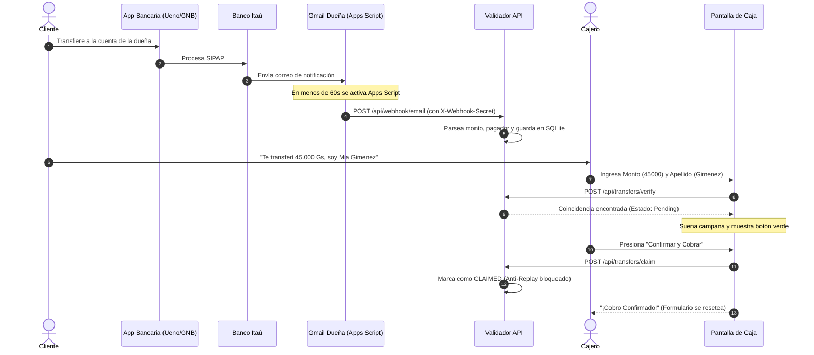

# 🏪 Validador de Transferencias para PYMEs (Itaú, GNB, UENO / SIPAP Paraguay)

[](https://www.typescriptlang.org/)
[](https://nodejs.org/)
[](#-arquitectura)
[](#-pruebas-automatizadas)
[](https://opensource.org/licenses/MIT)

Sistema open-source en **TypeScript** diseñado para resolver el cuello de botella más común en cajas de comercios (kioskos, almacenes, farmacias, cafeterías): **verificar transferencias bancarias en tiempo real sin requerir que la dueña revise su celular ni compartir contraseñas de correos o cuentas bancarias con los empleados.**

---

## ⚡ Despliegue en 1 Clic (100% Gratuito)

Desplegá tu propia instancia del validador en la nube en menos de 2 minutos sin pagar un solo dólar por servidores ni dominios:

[](https://render.com/deploy?repo=https://github.com/fugc123/validador-transferencias-pymes)
[](https://railway.app/template/new?template=https://github.com/fugc123/validador-transferencias-pymes)

---

## 🚀 Problema vs Solución

| El Problema Habitual | Nuestra Solución con Validador PYME |
|---|---|
| ❌ La dueña vive esclava del celular esperando que los cajeros le pregunten *"¿te llegó la plata?"*. | ✅ Los empleados validan el pago en **2 segundos** desde una pantalla web en la caja. |
| ❌ **Riesgo Crítico de Seguridad:** Darles la clave de Gmail a los empleados para que revisen los correos. | ✅ **Zero-Credentials:** Los empleados jamás acceden al Gmail ni ven las transferencias personales de la dueña. |
| ❌ **Estafa del Comprobante Reutilizado:** Clientes que pagan compras distintas usando la misma captura de pantalla. | ✅ **Anti-Replay Guard:** Cada transferencia se bloquea al instante de ser cobrada. Si la vuelven a presentar, la pantalla alerta en **ROJO**. |
| ❌ Clientes esperando 1 minuto con la fila trabada. | ✅ Validación en **15 milisegundos** gracias a SQLite nativo indexado. |

---

## 🏛️ Arquitectura del Sistema

Construido siguiendo **Clean Architecture (Puertos y Adaptadores)** en TypeScript estricto:

```
src/
├── domain/                      # Lógica de Negocio Pura (Independiente de frameworks)
│   ├── entities/                # Transfer y User Entities con invariantes de estado
│   └── ports/                   # Contratos (ITransferRepository, IUserRepository, IBankParser)
├── infrastructure/              # Adaptadores Tecnológicos
│   ├── database/                # SqliteTransferRepository y SqliteUserRepository (node:sqlite)
│   └── parsers/                 # BankParserFactory (Patrón Strategy multi-banco)
│       └── itau-paraguay.parser.ts
├── application/                 # Casos de Uso del Negocio
│   ├── use-cases/               # IngestEmail, VerifyTransfer, ClaimTransfer, AuthUseCases
│   └── dto/                     # Contratos tipados de entrada y salida
├── presentation/                # Controladores y Middlewares HTTP
│   ├── controllers/             # TransferController y AuthController
│   └── middlewares/             # WebhookAuth, AuthenticateJwt, RequireRole, RateLimiter, Helmet
└── public/                      # UI de Punto de Venta (Audio sintetizado con Web Audio API)
```

---

## 🔄 Flujo de Trabajo en Tiempo Real



---

## 💻 Instalación y Ejecución Local

### Requisitos
- **Node.js v22 o v24+** (utiliza `node:sqlite` nativo).
- Git.

### Pasos
```bash
# 1. Clonar el repositorio
git clone https://github.com/fugc123/validador-transferencias-pymes.git
cd validador-transferencias-pymes

# 2. Instalar dependencias
npm install

# 3. Compilar TypeScript
npm run build

# 4. Iniciar en modo desarrollo
npm run dev

# 5. O iniciar en modo producción
npm start
```

Abrir en el navegador: **[http://localhost:3000](http://localhost:3000)**

> **Credenciales iniciales por defecto:**  
> Email: `admin@kiosko.com`  
> Contraseña: `admin123`

---

## 🧪 Pruebas Automatizadas

El proyecto cuenta con suites completas de pruebas unitarias y de integración E2E con **Jest** y **Supertest**:

```bash
# Ejecutar todas las pruebas (16/16 passing)
npm test

# Ejecutar solo unitarias
npm run test:unit

# Ejecutar solo E2E
npm run test:e2e
```

---

## 🐳 Despliegue con Docker

Podés correr el validador en cualquier VPS o servidor con Docker:

```bash
# Construir la imagen
docker build -t validador-pymes .

# Correr con volumen persistente para la base de datos
docker run -d -p 3000:3000 -v kiosko_data:/app/data --name validador validador-pymes
```

---

## 📧 Configuración en Gmail de la Dueña (Paso a Paso)

1. Ingresar a [script.google.com](https://script.google.com/) con la cuenta de Gmail donde llegan los avisos bancarios.
2. Hacer clic en **"Nuevo proyecto"**.
3. Reemplazar el código por el contenido de [`google-apps-script/code.gs`](google-apps-script/code.gs).
4. Configurar la variable `WEBHOOK_URL` con la URL de tu servidor (ej: `https://tu-app.onrender.com/api/webhook/email`).
5. Configurar `WEBHOOK_SECRET` con la misma clave configurada en tu `.env`.
6. Ir a **Activadores (reloj a la izquierda)** → **"Añadir activador"**:
   - Función que se ejecuta: `procesarCorreosItau`
   - Fuente del evento: `Según tiempo`
   - Tipo de temporizador: `Temporizador por minutos`
   - Intervalo: `Cada 1 minuto`
7. Guardar y conceder permisos de lectura a la aplicación.

### ❓ Solución de Problemas Comunes con Gmail
- **"El webhook da error 401":** Asegurate de que el `WEBHOOK_SECRET` en `code.gs` sea idéntico al configurado en el servidor.
- **"No detecta los correos":** Verificá que los correos en la bandeja de entrada provengan del remitente de Itaú y contengan la frase `"acreditada en cuenta"`. Si ya fueron leídos manualmente, marcalos como no leídos o quitá la etiqueta `Procesado_Kiosko` para volver a procesarlos.

---

## 🔌 Guía de Pruebas con cURL (API Rápida)

### 1. Iniciar sesión como Cajero / Admin
```bash
curl -X POST http://localhost:3000/api/auth/login \
  -H "Content-Type: application/json" \
  -d '{"email": "admin@kiosko.com", "password": "admin123"}'
```

### 2. Simular recepción de correo de Itaú (Webhook)
```bash
curl -X POST http://localhost:3000/api/webhook/email \
  -H "Content-Type: application/json" \
  -H "X-Webhook-Secret: kiosko-secreto-2026" \
  -d '{
    "text": "A continuación el detalle de la operación:\nNro. de operación: COMAPYPAARES260914370460000640061\nFecha y hora de operación: 14/09/2026 10:17:26\nCliente Pagador: MIA FIORELLA GIMENEZ AQUINO\nMoneda y Monto: PYG 45,000\nNro. comprobante: 8351454\nEstado: Transferencia acreditada en cuenta"
  }'
```

### 3. Verificar transferencia desde la caja
```bash
curl -X POST http://localhost:3000/api/transfers/verify \
  -H "Content-Type: application/json" \
  -H "Authorization: Bearer <TU_TOKEN_JWT>" \
  -d '{"amount": 45000, "name": "Gimenez"}'
```

---

## 📄 Licencia

Este proyecto está distribuido bajo la licencia **MIT**. Podés usarlo, modificarlo y desplegarlo libremente para tu negocio o clientes.
